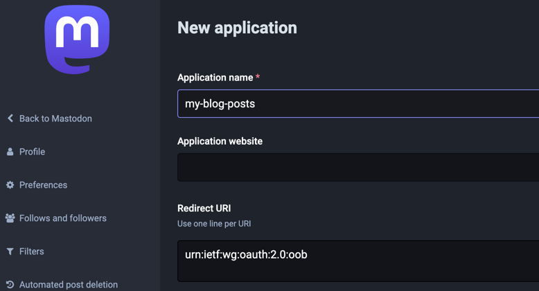
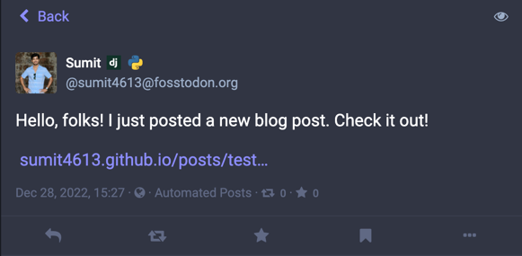

# Post to Mastodon GitHub Action

[](https://github.com/sumit4613/post-to-mastodon/releases/latest)
[](https://github.com/sumit4613/post-to-mastodon/blob/main/LICENSE)

## About

A Github Action which sends a `toot` to Mastodon instance when you publish a new blog post. Helps you to share your blog
post on Mastodon automatically.

## Usage

The Action expects few environment variables to be set. `access_token` needs to be set as a secret in the repository.
Others can be defined in the `with` section of the action. Here's an example:

```yml
name: Send a toot to Mastodon

on:
  push:
    branches:
      - master  # Set a branch to deploy

jobs:
  post-to-mastodon:
    runs-on: ubuntu-latest
    steps:
      - uses: actions/checkout@v3
        with:
          fetch-depth: '0'
      # This is required to get the latest commit message with files names
      - name: Set env variables
        run: |
          # prints the current branch name
          echo $GITHUB_HEAD_REF
          # checkouts to the current branch which in case is master
          git checkout $GITHUB_HEAD_REF
          # format the commit message
          RECENTLY_ADDED_FILES=$(git log -1 --stat --oneline --name-only | tr '\n' '|')
          echo $RECENTLY_ADDED_FILES
          # set it as an environment variable
          echo "RECENTLY_ADDED_FILES=$RECENTLY_ADDED_FILES" >> $GITHUB_ENV

      - name: Post to Mastodon
        uses: sumit4613/post-to-mastodon@v0.1
        with:
          # This is the message that will be sent to Mastodon, override it with your own message if you want
          message: "Hello, folks! I just posted a new blog post. Check it out!"
          # Base URL of your blog post where your posts are hosted
          base_blog_url: "https://sumit4613.github.io/posts/"
          # access token of your Mastodon account
          access_token: ${{ secrets.MASTODON_ACCESS_TOKEN }}
          # Mastodon instance URL, default is fosstodon.org
          host: "fosstodon.org"
          port: "443"
          api: "api/v1"
```

## Inputs

This action expects few inputs to be passed to it. Here's a list of all the inputs:

| Name             | Description                                                                                                                                                                             |
|------------------|-----------------------------------------------------------------------------------------------------------------------------------------------------------------------------------------|
| `message`        | Message to be sent to Mastodon<br/> Default is set to `Hello, folks! I just posted a new blog post. Check it out!` <br/> Override this is you want to send toot with different message. |
| `base_blog_url`  | Base URL of your blog post where your posts are hosted.                                                                                                                                 |
| `base_directory` | Base directory where your blog posts are stored.<br/> Default is set to `content/posts/`                                                                                                |
| `access_token`   | Access token of your Mastodon account.                                                                                                                                                  |
| `host`           | Mastodon instance URL. <br/> Default is set to `fosstodon.org`                                                                                                                          |
| `port`           | Port of Mastodon instance. <br/> Default is set to `443`                                                                                                                                |
| `api`            | API endpoint of Mastodon instance. <br/> Default is set to `api/v1`                                                                                                                     |

## Notes

- This action will only send a toot when `publish` is there in your commit message, and it contains a file name which
  starts with the `base_directory` value. For example, if your `base_directory` is `content/posts/` and your commit
  message contains `publish content/posts/test-github-action.md`, then it will send a toot to Mastodon.

## Getting access token from Mastodon

- Go to your Mastodon instance and login to your account.
- Go to `Preferences or Settings` -> `Development` -> `New Application`
- Fill the form with the following values:
    - Application name: `<your-app-name>`
    - Redirect URI: `urn:ietf:wg:oauth:2.0:oob`
- We atleast need `read` and `write` permissions for this action to work.
- Click on `Submit or Register` button.
- You will see a page with `Client Key`, `Client Secret` and `Access Token`.
- Copy the `Access Token` and set it as a secret in your repository.
- 

## How it looks like on Mastodon



## Contributing

Suggestions and contributions are welcome. Feel free to open an issue or a pull request.

## License

This project is licensed under the MIT License - see the [LICENSE](LICENSE) file for details